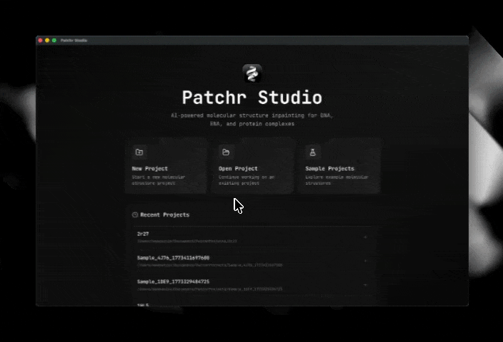
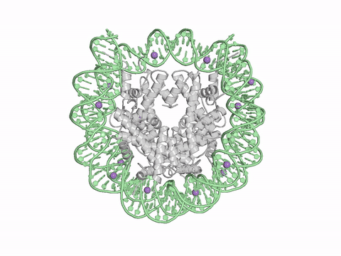
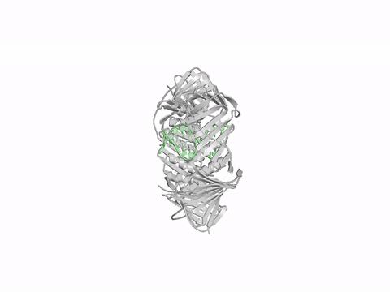
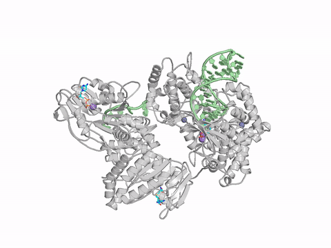
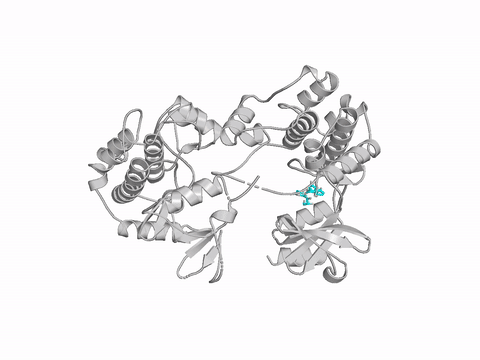

<div align="center">
  <div>&nbsp;</div>


# PATCHR

**Structure inpainting and simulation-ready setup for proteins, DNA, RNA, and complexes**

[](LICENSE)
[](https://www.python.org/)
[](https://colab.research.google.com/github/DeepFoldProtein/patchr/blob/main/colab_server.ipynb)

[Website](https://patchr.deepfold.org/) | [Atlas](https://patchr.deepfold.org/atlas) | [Paper](#cite) | [PATCHR-Studio](#patchr-studio)

**Download PATCHR-Studio:**&nbsp;&nbsp;
[Windows](https://github.com/DeepFoldProtein/patchr/releases/latest/download/patchr-studio-setup.exe) ·
[macOS (Apple Silicon)](https://github.com/DeepFoldProtein/patchr/releases/latest/download/patchr-studio.dmg) ·
[Linux](https://github.com/DeepFoldProtein/patchr/releases/latest/download/patchr-studio.AppImage)

</div>

---

<div align="center">
<table>
  <tr><td align="center"></td></tr>
  <tr align="center"><td><b>PATCHR-Studio</b> : end-to-end desktop workflow &mdash; load a structure, mark gaps, inpaint, and export</td></tr>
</table>
</div>

<div align="center">
<table>
  <tr>
    <td align="center"></td>
    <td align="center"></td>
  </tr>
  <tr align="center">
    <td><b>1KX3</b> : nucleosome histone-tail inpainting</td>
    <td><b>6GIS</b> : PCNA + 50 bp DNA extension</td>
  </tr>
  <tr>
    <td align="center"></td>
    <td align="center"></td>
  </tr>
  <tr align="center">
    <td><b>8GZR</b> : NS3 polymerase + RNA reconstruction</td>
    <td><b>4ZLO</b> : Kinase inpainting with ligand</td>
  </tr>
</table>
</div>

Most experimental structures in the PDB have **missing regions** -- flexible loops, disordered terminals, unresolved sidechains. PATCHR fills them in using **diffusion-based inpainting** while keeping existing coordinates **exactly as-is**.

- **Backend-agnostic** -- supports [Boltz-2](https://github.com/jwohlwend/boltz) and [Protenix](https://github.com/bytedance/protenix)
- Works with **proteins, DNA, RNA**, and multi-chain complexes
- 99.4% connectivity pass rate, from short loops to 600+ residue extensions

<div align="center">

## [PATCHR Atlas](https://patchr.deepfold.org/atlas) &mdash; large-scale inpainting of the PDB

From **every PDB complex with an internal missing region** (excluding very large structures), PATCHR inpainted the full set of **66,417 multimeric structures** &mdash; all browsable and downloadable.

### [Explore the Atlas &rarr;](https://patchr.deepfold.org/atlas)

</div>

---

**Benchmark** &mdash; 940 PDB40 structures with artificially introduced gaps mirroring real PDB missing-region statistics. C&#945; and all-atom RMSD computed over inpainted residues only.

| Method / Configuration | C&#945; RMSD (&#8491;) | All-atom RMSD (&#8491;) |
|---|:---:|:---:|
| **PATCHR (full, + LRD)** | **1.781** | **2.542** |
| Boltz-2 + template conditioning | 4.647 | 5.510 |
| Boltz-2 + template conditioning + steering (threshold = 5.0 &#8491;) | 3.675 | 4.342 |
| Boltz-2 + template conditioning + steering (threshold = 2.0 &#8491;) | 3.397 | 4.081 |
| Boltz-2 + template conditioning + steering (threshold = 0.5 &#8491;) | 3.219 | 3.889 |
| RFdiffusion2 (all-atom) | 9.188 | 10.199 |
| RFdiffusion (backbone-only) | 2.043 | &mdash; |

## Installation

```bash
git clone https://github.com/DeepFoldProtein/patchr.git
cd patchr && pip install -e .
```

<details>
<summary><b>Mac</b></summary>

```bash
conda create --name patchr python=3.12 llvmlite==0.44.0 numba==0.61.0 numpy==1.26.3
conda activate patchr
git clone https://github.com/DeepFoldProtein/patchr.git
cd patchr && pip install -e .
export KMP_DUPLICATE_LIB_OK=TRUE
```

</details>

<details>
<summary><b>Docker</b></summary>

```bash
./scripts/docker-run.sh                # Run with all GPUs
PATCHR_GPU=0 ./scripts/docker-run.sh   # Select GPU
```

Model weights are cached at `~/.boltz` on the host (override with `BOLTZ_CACHE`).

For Slurm clusters with Apptainer:

```bash
sbatch scripts/slurm-run.sh
```

</details>

## Quick Start

**1. Generate a template** from a PDB structure:

```bash
patchr template 1TON all
```

**2. Run inpainting:**

```bash
patchr predict examples/inpainting/1ton_AB.yaml --out_dir results
```

The first run downloads the model checkpoint automatically to `~/.boltz/`.

<details>
<summary><b>Template options</b></summary>

```bash
patchr template 1CK4 all                    # All polymer chains
patchr template 4ZLO A,B --uniprot          # With UniProt sequence
patchr template --input structure.cif A,B    # From local CIF
patchr template 7EOQ all-copies             # Including duplicate copies
patchr template 1BNA all -o my_templates/   # Custom output directory
patchr template 7EOQ A --include-solvent     # Include solvent atoms
patchr template 1CK4 all --assembly best     # Biological assembly
patchr template 1CK4 all --relative-paths    # Use relative paths in YAML (default: absolute)
```

</details>

<details>
<summary><b>Prediction options</b></summary>

```bash
# Single file
patchr predict examples/inpainting/4zlo_ABCD.yaml --out_dir results --seed 42
patchr predict examples/inpainting/1ck4_AB.yaml --out_dir results --diffusion_samples 5
patchr predict examples/inpainting/1bna_AB.yaml --out_dir results --backend protenix
patchr predict examples/inpainting/7eoq_ABCDEFGHIJKLMN.yaml --out_dir results --use_msa_server

# Bulk prediction — pass a directory of YAML files
patchr predict my_templates/ --out_dir results
patchr predict my_templates/ --out_dir results --backend protenix --seeds 42,101
```

</details>

## Simulation-Ready Output

Go directly from structure completion to MD simulation input:

```bash
patchr predict input.yaml --out_dir results --sim-ready gromacs
patchr predict input.yaml --out_dir results --sim-ready amber --ff amber14sb
```

<details>
<summary><b>Standalone command</b></summary>

```bash
patchr sim-ready prediction.cif --engine gromacs --ff charmm36m
patchr sim-ready prediction.cif --engine openmm --padding 1.2 --ion-conc 0.15
```

</details>

## How It Works

PATCHR uses diffusion-based generation conditioned on your experimental structure as a rigid template:

| | Technique | What it does |
|---|---|---|
| 1 | **Template Conditioning** | Anchors known coordinates at every diffusion step |
| 2 | **Synchronized Rigid Template Tracking** | Keeps the template aligned with the evolving generation |
| 3 | **Local Refinement Denoising** | Cleans up bond geometry at template-generation junctions |

## PATCHR-Studio

A desktop application providing a graphical interface to the full workflow, with no command line required. Download from the links above or the [releases page](https://github.com/DeepFoldProtein/patchr/releases).

Beyond reconstructing missing regions, the interactive sequence editor supports residue-level edits applied directly on the structure and regenerated in a single inpainting run:

- **Erase and regenerate** &mdash; remove resolved residues and re-inpaint them
- **Mutation** &mdash; substitute a residue identity; the side chain is rebuilt by inpainting
- **Post-translational modifications** &mdash; introduce modified residues (SEP, TPO, PTR, MLY, M3L)

Staged edits are listed and individually reversible prior to execution, and outputs are versioned for comparison across runs. Prediction, GPU queue status, and simulation-ready export are integrated.

See [**docs/STUDIO.md**](docs/STUDIO.md) for the complete feature and parameter reference (Studio, CLI, and REST API).

**No GPU?** Run the server on [Google Colab](https://colab.research.google.com/github/DeepFoldProtein/patchr/blob/main/colab_server.ipynb) for free and connect from PATCHR-Studio.

## Server

```bash
patchr serve --model boltz2 --device-id 0
patchr serve --model protenix --port 8080
patchr serve --model all
```

## Performance

Beyond the headline RMSDs above, PATCHR also produces simulation-ready geometry:

| Metric | Value |
|---|---|
| Backbone RMSD (missing residues) | 1.78 &#8491; |
| lDDT (missing atoms) | 98.6 |
| Connectivity pass rate | 99.4% |

<details>
<summary><b>Impact of Local Refinement Denoising (LRD)</b></summary>

| Metric | With LRD | Without LRD |
|---|:---:|:---:|
| Structures with no issues | **99.4%** | 87.4% |
| C&#945;--C&#945; gaps (4.5--10 &#8491;) | 0.21% | 4.57% |
| Peptide bond (C--N) issues | 0.85% | 15.43% |
| Broken chains (>10 &#8491;) | 0.32% | 0.74% |

</details>

<details>
<summary><b>Accuracy by structural context</b></summary>

| Secondary structure | RMSD (&#8491;) | | Solvent accessibility | RMSD (&#8491;) |
|---|:---:|---|---|:---:|
| Helix | 0.30 | | Buried | 0.39 |
| Strand | 0.26 | | Intermediate | 0.65 |
| Loop | 0.85 | | Surface | 1.01 |

</details>

## Future Work

Any model trained on the AlphaFold3 framework can be converted into an inpainting model through the PATCHR protocol. Currently implemented for **Boltz-2** and **Protenix** only; extending to additional AF3-family backends is planned.

## Acknowledgments

PATCHR builds upon [Boltz-2](https://github.com/jwohlwend/boltz) by Passaro, Corso, Wohlwend et al. and [Protenix](https://github.com/bytedance/protenix) by ByteDance.
## License

MIT -- free for academic and commercial use.

## Cite

```bibtex
@article{bae2025patchr,
  author = {Bae, Hanjin and Kim, Kunwoo and Yoo, Jejoong and Joo, Keehyoung},
  title = {PATCHR-Studio: Template-conditioned diffusion-based molecular structure
           inpainting for Protein, RNA, and DNA complexes},
  year = {2025}
}
```
