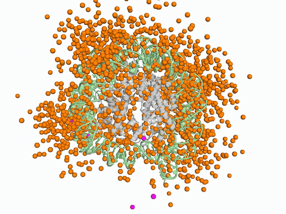
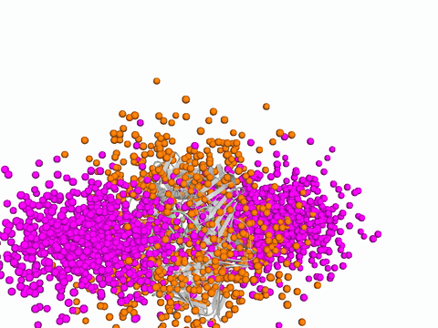
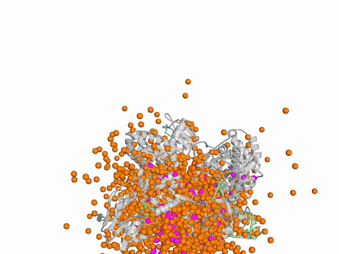
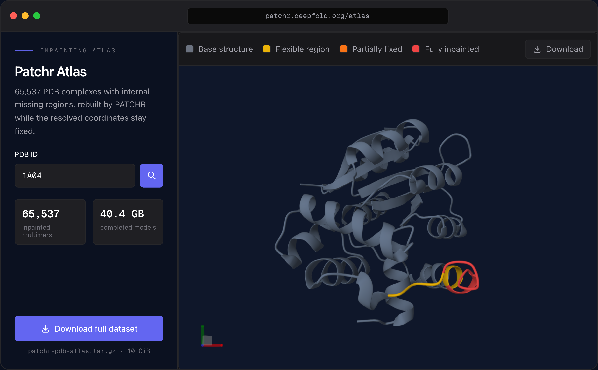

<div align="center">
  <div>&nbsp;</div>


# PATCHR

**Structure inpainting and simulation-ready setup for proteins, DNA, RNA, and complexes**

[](LICENSE)
[](https://www.python.org/)
[](https://colab.research.google.com/github/DeepFoldProtein/patchr/blob/main/colab_server.ipynb)

[Website](https://patchr.deepfold.org/) | [Atlas](https://patchr.deepfold.org/atlas) | [Paper](#cite) | [PATCHR-Studio](#patchr-studio)

**Download PATCHR-Studio:**&nbsp;&nbsp;
[Windows](https://github.com/DeepFoldProtein/patchr/releases/latest/download/patchr-studio-setup.exe) ·
[macOS (Apple Silicon)](https://github.com/DeepFoldProtein/patchr/releases/latest/download/patchr-studio.dmg) ·
[Linux](https://github.com/DeepFoldProtein/patchr/releases/latest/download/patchr-studio.AppImage)

</div>

---

<div align="center">
<table>
  <tr><td align="center"></td></tr>
  <tr align="center"><td><b>PATCHR-Studio</b> : the end-to-end desktop workflow (load a structure, mark gaps, inpaint, export)</td></tr>
</table>
</div>

<div align="center">
<table>
  <tr>
    <td align="center"></td>
    <td align="center"></td>
    <td align="center"></td>
  </tr>
  <tr align="center">
    <td><b>1KX3</b> : nucleosome histone-tail inpainting</td>
    <td><b>6GIS</b> : PCNA + 50 bp DNA extension</td>
    <td><b>8GZR</b> : NS3 polymerase + RNA reconstruction</td>
  </tr>
</table>

<sub>Template-constrained diffusion in progress: the template is rigidly realigned to the evolving coordinate frame at every denoising step, so it tracks the generation instead of drifting away from it.</sub>

</div>

Only 18% of PDB40 entries are fully resolved. The rest have **missing regions**: flexible loops, disordered termini, unresolved side chains. PATCHR rebuilds them with **template-constrained diffusion**, and the coordinates that were resolved experimentally stay **exactly as deposited**.

- **Backend-agnostic**: works with [Boltz-2](https://github.com/jwohlwend/boltz) and [Protenix](https://github.com/bytedance/protenix)
- Handles **proteins, DNA, RNA**, and multi-chain complexes
- 99.4% of reconstructions have no connectivity issues ([below](#performance)); rebuilt segments run from short loops to 600+ residue extensions

<div align="center">

## [PATCHR-Atlas](https://patchr.deepfold.org/atlas): large-scale inpainting of the PDB

PATCHR has completed **65,537 multimeric assemblies**, covering every PDB complex that has an internal missing region and fits within a 4,000-token budget. An internal gap is one flanked on both sides by resolved residues, rather than trailing off a disordered terminus, so inpainting is genuinely required. The assemblies span protein-protein, protein-nucleic acid, and ligand-bound complexes.

<a href="https://patchr.deepfold.org/atlas"></a>

<sub>Look up any PDB ID, inspect the reconstruction coloured by region type, and download the completed model. The full dataset is also available as a single archive.</sub>

### [Explore the Atlas &rarr;](https://patchr.deepfold.org/atlas)

</div>

---

**Benchmark.** 940 PDB40 structures with artificially introduced gaps mirroring real PDB missing-region statistics. Mean backbone RMSD over missing residues, reported for C&#945; and for all atoms.

| Method / Configuration | C&#945; RMSD (&#8491;) | All-atom RMSD (&#8491;) |
|---|:---:|:---:|
| *All-atom models* | | |
| **PATCHR** | **1.781** | **2.542** |
| Boltz-2 baseline (no modification) | 11.187 | 11.932 |
| &nbsp;&nbsp;+ template conditioning | 4.647 | 5.510 |
| &nbsp;&nbsp;+ template conditioning + steering (threshold = 5.0 &#8491;) | 3.675 | 4.342 |
| &nbsp;&nbsp;+ template conditioning + steering (threshold = 2.0 &#8491;) | 3.397 | 4.081 |
| &nbsp;&nbsp;+ template conditioning + steering (threshold = 0.5 &#8491;) | 3.219 | 3.889 |
| RFdiffusion2 <sup>&sect;</sup> | 9.188 | 10.199 |
| *Backbone-only models* | | |
| RFdiffusion | 2.043 | &mdash; |

<sup>&sect;</sup> Flow-matching model; produces severely distorted structures, value reported for reference.

Each Boltz-2 ablation row adds one modification to the row above it. PATCHR keeps template conditioning but replaces steering with TCD and LRD.

## Installation

```bash
git clone https://github.com/DeepFoldProtein/patchr.git
cd patchr && pip install -e .
```

<details>
<summary><b>Mac</b></summary>

```bash
conda create --name patchr python=3.12 llvmlite==0.44.0 numba==0.61.0 numpy==1.26.3
conda activate patchr
git clone https://github.com/DeepFoldProtein/patchr.git
cd patchr && pip install -e .
export KMP_DUPLICATE_LIB_OK=TRUE
```

</details>

<details>
<summary><b>Docker</b></summary>

```bash
./scripts/docker-run.sh                # Run with all GPUs
PATCHR_GPU=0 ./scripts/docker-run.sh   # Select GPU
```

Model weights are cached at `~/.boltz` on the host (override with `BOLTZ_CACHE`).

For Slurm clusters with Apptainer:

```bash
sbatch scripts/slurm-run.sh
```

</details>

## Quick Start

**1. Generate a template** from a PDB structure:

```bash
patchr template 1TON all
```

**2. Run inpainting:**

```bash
patchr predict examples/inpainting/1ton_AB.yaml --out_dir results
```

The first run downloads the model checkpoint automatically to `~/.boltz/`.

<details>
<summary><b>Template options</b></summary>

```bash
patchr template 1CK4 all                    # All polymer chains
patchr template 4ZLO A,B --uniprot          # With UniProt sequence
patchr template --input structure.cif A,B    # From local CIF
patchr template 7EOQ all-copies             # Including duplicate copies
patchr template 1BNA all -o my_templates/   # Custom output directory
patchr template 7EOQ A --include-solvent     # Include solvent atoms
patchr template 1CK4 all --assembly best     # Biological assembly
patchr template 1CK4 all --relative-paths    # Use relative paths in YAML (default: absolute)
```

</details>

<details>
<summary><b>Prediction options</b></summary>

```bash
# Single file
patchr predict examples/inpainting/4zlo_ABCD.yaml --out_dir results --seed 42
patchr predict examples/inpainting/1ck4_AB.yaml --out_dir results --diffusion_samples 5
patchr predict examples/inpainting/1bna_AB.yaml --out_dir results --backend protenix
patchr predict examples/inpainting/7eoq_ABCDEFGHIJKLMN.yaml --out_dir results --use_msa_server

# Bulk prediction: pass a directory of YAML files
patchr predict my_templates/ --out_dir results
patchr predict my_templates/ --out_dir results --backend protenix --seeds 42,101
```

</details>

## Simulation-Ready Output

Go directly from structure completion to MD simulation input:

```bash
patchr predict input.yaml --out_dir results --sim-ready gromacs
patchr predict input.yaml --out_dir results --sim-ready amber --ff amber14sb
```

<details>
<summary><b>Standalone command</b></summary>

```bash
patchr sim-ready prediction.cif --engine gromacs --ff charmm36m
patchr sim-ready prediction.cif --engine openmm --padding 1.2 --ion-conc 0.15
```

</details>

## How It Works

PATCHR operates entirely at inference time on a pretrained diffusion model and requires no retraining. Two components are added around the backbone's denoising module:

| | Component | What it does |
|---|---|---|
| 1 | **Template-Constrained Diffusion (TCD)** | Injects the fixed template atoms through a binary mask at every denoising step, while the missing segments are denoised. Weighted Kabsch realigns the template to the evolving coordinate frame, so it tracks the generation |
| 2 | **Local Refinement Diffusion (LRD)** | Re-denoises a narrow boundary window at each template-generated junction, restoring covalent connectivity and stereochemistry without disturbing the global fold |

TCD is not the template *conditioning* that AlphaFold3-architecture models already offer. There the template enters the network as an embedding, and nothing guarantees the deposited coordinates survive into the output. PATCHR applies the template directly at the denoising step instead, which holds the experimental coordinates fixed throughout generation.

## PATCHR-Studio

A desktop application that runs the whole workflow through a graphical interface, with no command line. Download it from the links above or the [releases page](https://github.com/DeepFoldProtein/patchr/releases).

The sequence editor also makes residue-level edits, which are rebuilt in the same inpainting run:

- **Erase and regenerate**: remove resolved residues and re-inpaint them
- **Mutation**: substitute a residue identity; the side chain is rebuilt by inpainting
- **Post-translational modifications**: install modified residues (SEP, TPO, PTR, MLY, M3L)

Edits are staged, so each one is listed and can be reverted before a run starts. Outputs are versioned, which lets runs be compared rather than overwritten. Studio also reports GPU queue position and exports simulation-ready inputs.

See [**docs/STUDIO.md**](docs/STUDIO.md) for the complete feature and parameter reference (Studio, CLI, and REST API).

**No GPU?** Run the server on [Google Colab](https://colab.research.google.com/github/DeepFoldProtein/patchr/blob/main/colab_server.ipynb) for free and connect from PATCHR-Studio.

## Server

```bash
patchr serve --model boltz2 --device-id 0
patchr serve --model protenix --port 8080
patchr serve --model all
```

## Performance

PATCHR also produces geometry that passes the connectivity checks MD setup depends on:

| Metric | Value |
|---|---|
| Backbone RMSD (missing residues) | 1.78 &#8491; |
| lDDT (missing atoms) | 98.6 |
| Connectivity pass rate | 99.4% |

<details>
<summary><b>Impact of Local Refinement Diffusion (LRD)</b></summary>

| Metric | With LRD | Without LRD |
|---|:---:|:---:|
| Structures with no issues | **99.4%** | 87.4% |
| Broken chains (>10.0 &#8491;) | 0.32% | 0.74% |
| C&#945;--C&#945; gaps (4.5--10.0 &#8491;) | 0.21% | 4.57% |
| Peptide bond (C--N) issues | 0.85% | 15.43% |
| Backbone atom distance issues | 0.32% | 0.00% |

</details>

<details>
<summary><b>Accuracy by structural context</b></summary>

| Secondary structure | RMSD (&#8491;) | | Solvent accessibility | RMSD (&#8491;) |
|---|:---:|---|---|:---:|
| Loop | 0.852 | | Surface-exposed | 1.006 |
| Helix | 0.296 | | Interface | 0.646 |
| Strand | 0.257 | | Buried | 0.389 |

</details>

## Future Work

The PATCHR protocol applies to any model built on the AlphaFold3 architecture, where atomic coordinates are generated by an EDM-based diffusion module in a global reference frame. Currently implemented for **Boltz-2** and **Protenix** only; extending to additional AF3-family backends is planned.

## Acknowledgments

PATCHR builds upon [Boltz-2](https://github.com/jwohlwend/boltz) by Passaro, Corso, Wohlwend et al. and [Protenix](https://github.com/bytedance/protenix) by ByteDance.

## License

MIT. Free for academic and commercial use.

## Cite

```bibtex
@article{bae2025patchr,
  author = {Bae, Hanjin and Kim, Kunwoo and Yoo, Jejoong and Joo, Keehyoung},
  title = {PATCHR: Molecular Structure Inpainting for Protein, RNA, and DNA
           Complexes Using Template-Constrained Diffusion},
  year = {2026}
}
```
