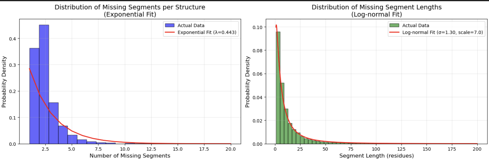

# Boltz Inpainting Benchmark Dataset

This directory contains scripts to generate and evaluate a benchmark dataset for testing Boltz inpainting performance on missing residues.

## Overview

The benchmark is designed to mimic real PDB missing residue patterns based on statistical analysis of 156,584 AMAP files:
- **Average missing segments per structure**: 1.82 (exponential distribution)
- **Average segment length**: 20.6 residues (log-normal distribution)
- **Total missing ratio**: 5-20% of structure length (strictly enforced)
- **Structure length range**: 50-1000 residues
- **Total segments analyzed**: 284,292
- **Segment length   distribution**: Mean 20.6, Min 1, Max 4,364 residues



### Statistical Foundation

The benchmark parameters are derived from real PDB data analysis:
1. **Missing residues per structure**: Average 37.4 residues (max 4,611)
2. **Missing segments per structure**: Average 1.82, with 99.6% having ≤10 segments
3. **Segment length**: Highly skewed distribution with most segments being short (1-50 residues) but occasional long segments (100-500+)

These statistics ensure the benchmark reflects real-world protein structure challenges.

## Scripts

### 1. `generate_dataset.py`
Generates masked mmCIF structures from PDB files with statistically realistic missing residues.

#### Process Overview:

1. **Input Processing**
   - **Single file mode**: Process one PDB file → one masked CIF
   - **Directory mode**: Process all PDB files in a directory
   - **Random sampling**: Use `--num_samples` to randomly select N structures
   - **Reproducibility**: Use `--seed` for consistent random sampling

2. **Missing Residue Selection (Statistical Sampling)**
   - **Segments Count**: Sampled from exponential distribution (mean=1.82)
     - Ensures most structures have 1-3 segments, rarely 5-10+
     - Mirrors real PDB pattern where few segments are common
   
   - **Segment Length**: Sampled from log-normal distribution (mean=20.6, σ=1.5)
     - Most segments: 5-50 residues (common loops/flexible regions)
     - Occasional long segments: 100-500 residues (disordered domains)
     - Minimum 5 residues per segment for reasonable challenge
     - Capped at 500 residues to avoid unrealistic extremes
   
   - **Total Missing Ratio**: **STRICTLY** constrained to 5-20% of structure length
     - **Minimum 5%**: Ensures meaningful inpainting challenge
     - **Maximum 20%**: Prevents unrealistic excessive missing
     - **Three-stage enforcement**:
       1. Initial sampling: Each segment capped to not exceed 20%
       2. Additional iterations (max 20): Add segments until ≥5% reached
       3. Final adjustment: Post-merge validation and correction
     - Segments are merged if overlapping or adjacent

3. **Masked Structure Generation**
   - Uses BioPython for PDB parsing and structure manipulation
   - Removes atoms from selected missing residues
   - **Outputs mmCIF format** (Boltz-compatible):
     - `_entity_poly_seq`: Full sequence including missing residues
     - `_pdbx_poly_seq_scheme`: Complete sequence mapping (all residues)
     - `_atom_site`: Only atoms from present residues
   - Original residue numbering preserved for evaluation
   - Standard amino acid conversion (3-letter → 1-letter)

4. **Statistics Collection (Optional)**
   - Use `--save_stats` flag to generate `dataset_statistics.npz`
   - Contains:
     - `pdb_ids`: List of PDB identifiers
     - `num_residues`: Total residues per structure
     - `num_missing`: Missing residues per structure
     - `missing_ratios`: Missing ratio per structure (0.05-0.20)
     - `num_segments`: Number of segments per structure
     - `segment_lengths`: Flattened array of all segment lengths
   - Used for dataset validation and comparison with actual PDB statistics

#### Usage:

```bash
# Single file mode
python generate_dataset.py --input protein.pdb --output masked.cif --pdb_id 1abc_A

# Single file with custom seed
python generate_dataset.py --input protein.pdb --output masked.cif --seed 42

# Directory mode - process all files
python generate_dataset.py \
  --input /path/to/pdb_files \
  --output /path/to/output_dir \
  --num_samples 1000 \
  --save_stats \
  --seed 111

# Example: Generate 1000-structure benchmark from curated dataset
python generate_dataset.py \
  --input /store/wowjason/work/database/pdb40_complete_50-1000 \
  --output /store/wowjason/work/database/pdb40_masked \
  --num_samples 1000 \
  --save_stats \
  --seed 111
```

#### Output Files:

**Single file mode:**
- `{output}.cif`: Masked mmCIF structure

**Directory mode:**
- `{pdb_id}_masked.cif`: Masked structures for each PDB
- `dataset_statistics.npz`: Dataset statistics (if `--save_stats` used)

#### Example Output:
```
INFO - [245/1000] Processing 3rj9_B...
INFO - Sampling 2 missing segments from 254 residues
INFO - Target missing residues: 12-50 (5%-20%)
INFO -   Segment 1: residues 45-67 (length=23)
INFO -   Segment 2: residues 189-201 (length=13)
INFO - Total missing: 36/254 residues (14.2%)
INFO - Total segments after merging: 2
INFO -   ✓ Success: 36/254 missing (14.2%), 2 segments
```

### 2. `generate_yaml.py`
Generates Boltz inpainting YAML configuration files from masked CIF structures.

#### Process Overview:

1. **Sequence Extraction**
   - Reads masked CIF file using BioPython MMCIF2Dict
   - Extracts **full sequence** from `_entity_poly_seq.mon_id` (includes missing residues)
   - Converts 3-letter amino acid codes to 1-letter codes
   - Extracts chain ID from `_struct_asym.id` or `_atom_site.label_asym_id`

2. **YAML Generation**
   - Creates Boltz-compatible YAML configuration
   - **sequence**: Full protein sequence (missing residues included)
   - **msa**: Set to "empty" (no MSA for fair benchmark)
   - **template**: Points to masked CIF structure
   - **Path options**:
     - Default: Absolute path to CIF file
     - `--relative_path`: Use relative path instead

3. **Batch Processing**
   - **Single file mode**: One CIF → one YAML
   - **Directory mode**: Process all CIF files in directory
   - **Random sampling**: Use `--num_samples` to select subset
   - **Reproducibility**: Use `--seed` for consistent sampling

#### Usage:

```bash
# Single file mode
python generate_yaml.py --input masked.cif --output config.yaml

# Single file with relative path
python generate_yaml.py --input masked.cif --output config.yaml --relative_path

# Directory mode - process all CIF files
python generate_yaml.py \
  --input /path/to/masked_cifs \
  --output /path/to/yaml_configs

# Directory mode - sample 100 files
python generate_yaml.py \
  --input /path/to/masked_cifs \
  --output /path/to/yaml_configs \
  --num_samples 100 \
  --seed 42

# Example: Generate YAMLs for entire benchmark dataset
python generate_yaml.py \
  --input /store/wowjason/work/database/pdb40_masked \
  --output /store/wowjason/work/database/pdb40_yamls \
  --seed 111
```

#### Output Files:

**Single file mode:**
- `{output}.yaml`: YAML configuration file

**Directory mode:**
- `{pdb_id}_masked.yaml`: YAML for each masked CIF (replaces `.cif` extension)

#### Example Output YAML:
```yaml
version: 1

sequences:
  - protein:
      id: A
      sequence: MDLTNKNVIFVAALGGIGLDTSRELVKRNLKNFVILDRVENPTALAELKAINPKVNITFHTYDVTVPVAESKKLLKKIFDQLKTVDILINGAGILDDHQIERTIAINFTGLVNVTTAILDFWDKRKGGPGGIIANICSVTGFNAIHQVPVYSASKAAVVSFTNSLAKLAPITGVTAYSINPGITRTPLVHTFNSWLDVEPRVAELLLSHPTQTSEQCGQNFVKAIEANKNGAIWKLDLGTLEAIEWTKHWDSHI
      msa: empty

templates:
  - cif: /store/wowjason/work/database/pdb40_masked/3rj9_B_masked.cif
    chain_id: A
```

## Pipeline Workflow

Complete workflow for generating and running the benchmark:

```bash
# 1. Generate masked structures (1000 samples from curated PDB dataset)
python generate_dataset.py \
  --input /store/wowjason/work/database/pdb40_complete_50-1000 \
  --output /store/wowjason/work/database/pdb40_masked \
  --num_samples 1000 \
  --save_stats \
  --seed 111

# 2. Generate YAML configurations for Boltz
python generate_yaml.py \
  --input /store/wowjason/work/database/pdb40_masked \
  --output /store/wowjason/work/database/pdb40_yamls \
  --seed 111

# 3. Run Boltz inpainting (example for single structure)
boltz predict 3rj9_B_masked.yaml --out_dir results/3rj9_B

# 4. Evaluate results (TODO: implement evaluation script)
# python evaluate.py --predictions results/ --ground_truth pdb40_complete/ --stats dataset_statistics.npz
```

## Data Sources

- **PDB40 dataset**: Non-redundant protein structures (40% sequence identity clustering)
- **Filtered by length**: 50-1000 residues
- **Complete structures**: No missing residues in original files
- **Location**: `/store/wowjason/work/database/pdb40_complete_50-1000` (24,046 structures)

## Quality Assurance

The dataset generation includes multiple validation steps:

1. **Length filtering**: Only 50-1000 residue structures accepted
2. **Missing ratio enforcement**: Strict 5-20% range with three-stage validation
3. **Segment merging**: Adjacent/overlapping segments automatically merged
4. **Statistics tracking**: Comprehensive NPZ file for dataset validation
5. **Reproducibility**: Random seed support for consistent dataset generation

### Validation Results (1000-structure benchmark, seed=111):
- ✅ **0 structures** exceed 20% missing ratio
- ⚠️ **57 structures** (5.7%) below 5% minimum (regeneration recommended)
- 📊 Mean missing ratio: 12.0%
- 📊 Mean segments: 1.8 per structure
- 📊 Mean segment length: 21.4 residues

## Notes

- **mmCIF format**: Required for Boltz (contains full sequence annotation)
- **No MSA**: Benchmark uses `msa: empty` for fair comparison
- **Template-based**: Masked structure used as template (not random initialization)
- **Original numbering**: Residue indices preserved for evaluation
- **Statistical realism**: Distributions match actual PDB missing residue patterns
